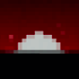

# LA MOD DEI BLAZERS!  
 
 

La prima, storica, ufficiale mod dei Blazers, i veri fan di [ErenBlaze](https://www.youtube.com/c/ErenBlaze)!

# 🔥 Perchè proprio la Blazers Mod?

L'obiettivo della mod è portare alcuni elementi del mondo di ErenBlaze all'interno di Minecraft, mantenendo, però, uno stile _vanilla_
aggiungendo anche contenuti di update mancati o che comunque non stonerebbero troppo all'interno del gioco base.

Quindi, benchè questa sia la _mod dei blazers_, è in realtà adatta a praticamente tutti! 😁

# 🪐 Cosa aggiunge la mod?

- **Due** nuovi minerali nell'Overworld: Zaffiro e Perla
- **Quattro** nuovi minerali nel Nether: Rubino, Onice, Malachite e Uranio
- Nuove armi, attrezzi e armature ottenuti dai minerali aggiunti e dallo Smeraldo
- Nuovi cibi ispirati alla cultura giapponese
- **Due** nuovi minerali "definitivi": Blazerite e Gyulianite
- **Due** nuovi quadri
- Alcune feature rimosse del "Wild Update": legni cavi, lucciole, tife, funghi sui lati dei tronchi, alberi caduti...
- Una nuova tipolgia di cavallo scheletrico nel Nether: il cavallo di scheletro wither
- Pulsanti di rame
- Nuove varianti di mattoni per diversi materiali
- Funzionalità per la Fletching Table
- Possibilità di ottenere Item Frame invisibili e Armor Stand con braccia o piccoli in survival
- Nuove stalattiti e stalagmiti di pietra e di ghiaccio
- **Diciannove** nuovi avanzamenti

# 🌐 Dove posso scaricarla?

La mod è scaricabile **esclusivamente** da [CurseForge](https://www.curseforge.com/minecraft/mc-mods/blazers-mod). 
Se avete ottenuto la mod tramite altri siti **cancellate il file immediatamente**, poichè potrebbe essere dannoso.

Ogni aggiornamento e nuova release verranno rilasciate lì, seguite da un aggiornamento (per il momento) sul sito di [MineWorld](https://mineworldminecraft.altervista.org/blog/), la mia mod personale. 

A breve arriverà anche un sito dedicato interamente al progetto, con la wiki dei vari crafting, blocchi, oggetti, mob..

Restate sintonizzati per scoprire il futuro della Blazers Mod e come questo sarà strettamente collegato a MineWorld 👀 

# 💰 Devo pagare per averla?

## _NO! LA MOD È COMPLETAMENTE GRATUITA, E SEMPRE LO SARÀ!_

Se avete pagato per ottenere questa mod, o se qualcuno vi chiede dei soldi per poterla avere, sappiate che vi sta truffando e, anzi,
dovreste denunciarlo per tentata frode!

Questa mod è un progetto portato avanti nel (poco) tempo libero a disposizione e chiaramente è un lavoro fatto con passione
e senza alcun intento di lucro. Per questo motivo la mod sarà **sempre** disponibile gratuitamente per chiunque!

Tuttavia, se volete supportare il progetto con una donazione, potete farlo tramite il link qui sotto, a patto che chiaramente siate
maggiorenni o comunque abbiate l'approvazione per farlo. **Non è obbligatorio**, ma chiaramente ogni piccolo supporto al progetto
sarà sempre ben accetto e riconosciuto 😁

_[BuyMeACoffee](https://www.buymeacoffee.com/JimiIT92)_

# 📃 Crediti

Tutto il codice della mod è stato scritto da me, con la gentile collaborazione dei ragazzi del [Forum di Minecraft Forge](https://forums.minecraftforge.net/),
grazie ai quali ho potuto risolvere alcuni bug ostici saltati fuori durante lo sviluppo.

Le texture e l'idea originale della mod sono tutte ad opera di ErenBlaze.

# 😁 Conclusioni

Spero che apprezziate il lavoro svolto e l'obiettivo preposto sia stato rispettato 😁

Se volete, inoltre, dare un'occhiata ai canali YouTube e Twitch miei e di ErenBlaze:

- MineHendrix _[YouTube](https://www.youtube.com/c/Minehendrix) | [Twitch](https://www.twitch.tv/minehendrix)_
- Erenblaze _[YouTube](https://www.youtube.com/c/ErenBlaze) | [Twitch](https://www.twitch.tv/erenblaze)_

Per il momento questo è tutto, gente! Se avete segnalazioni o idee inerenti la mod vi invito a farle utilizzando
[il seguente link](https://github.com/JimiIT92/BlazersMod/issues). **Non inviate messaggi privati, a me o a ErenBlaze, poichè verrebbero molto probabilmente ignorati...**

_Ciao a tutti, Blazers!_ 😎